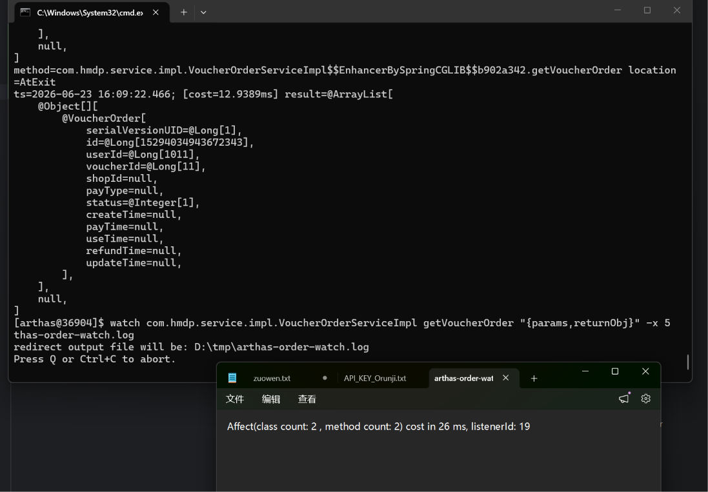

### 生产者消息确认回调验证

*故意填写错误的交换机名后，控制台打印消息未到达交换机日志，证明 ConfirmCallback 生效。*

### Arthas 验证异步下单链路

使用 Arthas `watch` 命令监控 `getVoucherOrder` 方法，确认消费者正确接收到订单消息，参数完整，耗时 7ms，订单状态成功更新为 1。验证了 RabbitMQ 异步下单链路的最终一致性。